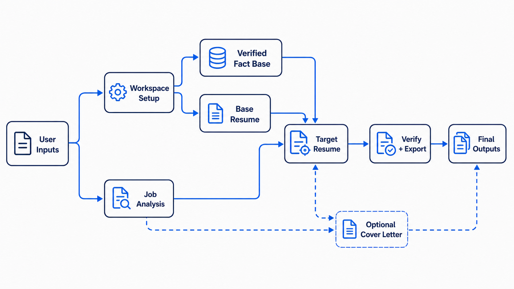
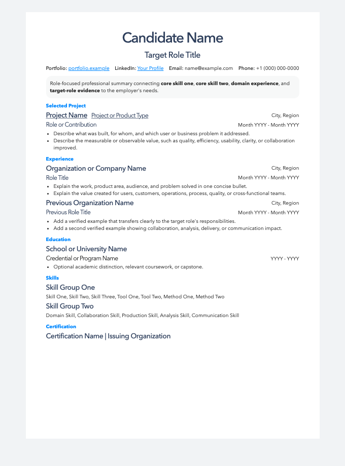

# Resume Assistant Starter Workspace

This is a sanitized starter workspace for an AI-assisted resume tailoring workflow.

It includes a generic ATS-friendly resume template in `base/index.html`. The default resume is designed as a one-page A4 HTML/PDF resume and should be copied into `applications/{date-company-role}/` for each target job before any job-specific changes are made. Users may replace the resume and cover letter templates with their own HTML/CSS and declare a different page target. Users can also ask the agent to recreate a template from a PDF, Word/DOCX resume, screenshot, image, Figma Dev Mode reference, exported CSS, or design notes.

## Start Here

1. Read `FIRST-TIME-SETUP.md`.
2. Fill `USER-INTAKE.md` with the user's information.
3. Choose the default template or provide a custom template source.
4. Replace the placeholders in `base/index.html`, or ask the agent to recreate it from the custom source.
5. Fill the modular fact base under `master/master-data/`.
6. Follow `AGENTS.md` for every job-specific tailoring task.
7. Run `npm run doctor` after `npm install` to confirm the workspace is ready and review template guidance.

## First-Run Choices

Before asking the agent to tailor a job, choose how the reusable workspace should be built:

1. Existing resume: attach or point the agent to a PDF resume, Word/DOCX resume, screenshot/image, Figma Dev Mode reference, existing HTML/CSS, exported CSS, or design notes.
2. Manual intake: fill `USER-INTAKE.md` or paste work history, projects, education, skills, target roles, and contact details.
3. Template choice: use the built-in one-page ATS-friendly template, or ask the agent to recreate a custom resume and cover letter template from the user's source.

Suggested first message:

```text
Use $resume-assistant to set up my resume workspace. I can provide [existing resume / work history / custom template source]. Please help me build the master fact base, choose a resume template, and prepare the workspace before tailoring jobs.
```

If the chosen template is visually complex, ask the agent to review ATS risk before building or using it.

## Workflow Overview

The workspace separates reusable source material from job-specific outputs. User inputs and verified facts feed the master fact base. The base resume provides the reusable layout. For every target job, the agent creates an application folder, analyzes the posting, copies the base resume into that folder, rewrites only the application-local target files, verifies layout, and exports final deliverables.



### Main Inputs And Outputs

| Stage | Inputs | Outputs |
| --- | --- | --- |
| Setup | Existing resume, manual intake, template preferences, contact details, user-confirmed facts | `base/index.html`, `base/styles.css`, `base/cover-letter-template.html`, `master/master-data/*` |
| Job analysis | Job URL or pasted job description, verified fact base, user preferences | `applications/{date-company-role}/job-analysis.md` with requirements, gaps, evidence mapping, ATS keywords, and strategy |
| Target resume | `base/index.html`, `base/styles.css`, `job-analysis.md`, master fact modules | `applications/{folder}/resume.html` and `applications/{folder}/styles.css` |
| Verification and export | Target resume HTML/CSS, page target, layout policy rules | Verified one-page or custom-page resume PDF, optional compare preview, recorded validation results |
| Cover letter, when needed | `job-analysis.md`, confirmed target resume, verified fact modules, cover letter guidelines | `cover-letter.md`, `cover-letter.html`, cover letter PDF after user confirmation |

### Base Resume Template Preview

The default base resume is a reusable, ATS-friendly one-page template. It should be copied into an application folder before any job-specific edits are made.



## What Is Included

- `base/index.html`: reusable base resume HTML template with instructional placeholders.
- `base/styles.css`: reusable resume and cover letter styling, print rules, and layout policy defaults.
- `base/cover-letter-template.html`: printable cover letter HTML template with instructional placeholders.
- `docs/workflow-overview-image2.png`: flat workflow diagram for the README.
- `docs/base-resume-template.png`: README preview image for the default base resume template.
- `master/master-resume.md`: entry point for the modular master resume fact base.
- `master/master-data/`: placeholder fact base files to be completed by the user.
- `applications/`: output folder for generated application-specific files.
- `application-log.md`: optional application tracking table.
- `AGENTS.md`: workflow rules for the resume-tailoring agent.
- `FIRST-TIME-SETUP.md`: checklist for preparing the template for a new user.
- `USER-INTAKE.md`: questionnaire for collecting the user's resume facts.
- `scripts/`: helper scripts for importing job postings, generating compare previews, and exporting PDFs.
- `templates/job-analysis-template.md`: optional manual log template for job analysis.
- `templates/cover-letter-draft-template.md`: optional Markdown starter for cover letter drafts.
- `templates/cover-letter-writing-guidelines.md`: reusable strategy guide for job-specific cover letter drafts.
- `templates/custom-template-intake.md`: checklist for creating a custom template from PDF, Word/DOCX, screenshots, Figma references, or design notes.
- `templates/header-style-options.md`: optional reusable header and contact-row styles for target resume layout optimization.
- `package.json`: convenience commands for local use.

## Model Guidance

Use a reasoning-capable Codex/OpenAI model for full resume tailoring. The workflow requires job-posting analysis, evidence matching, HTML/CSS edits, command execution, layout verification, and careful factual boundaries.

- Recommended for full workflows: the strongest high-reasoning Codex model available in your environment. OpenAI's public [model docs](https://platform.openai.com/docs/models) currently position GPT-5.5 as the flagship model for complex reasoning, coding, and professional work.
- Suitable for normal or cost-sensitive workflows: GPT-5.4-class models.
- Suitable for light maintenance: smaller models such as GPT-5.4 mini for setup, small copy edits, or script checks.
- Avoid very small or non-reasoning models for end-to-end resume tailoring.

## Custom Templates

The default template is optional. To use your own design, replace one or more of:

- `base/index.html`
- `base/styles.css`
- `base/cover-letter-template.html`

You do not need to provide HTML. Acceptable template sources include:

- Existing HTML/CSS.
- PDF resume.
- Word or DOCX resume.
- Screenshot or image of a resume design.
- Figma Dev Mode reference, Figma screenshot, or exported design specs.
- Existing website styles, exported CSS, or written design notes.

The agent should rebuild these sources into semantic HTML/CSS with selectable text, real links, and editable sections. Avoid image-only resumes.

Then record the template preferences in `USER-INTAKE.md` before the first tailoring task:

- Resume template: default or custom.
- Template source type.
- Resume page target: 1 page, 2 pages, or another explicit limit.
- Cover letter page target: 1 page, 2 pages, or another explicit limit.
- Whether strict one-page output is required.
- ATS risk choice: ATS-first adaptation, visual-faithful template, or default template.
- Any important section class names or structure differences.

If the custom design has many icons, two columns, a sidebar, tables, charts, skill bars, image-based text, portraits, QR codes, or complex decorative layout, the agent should warn the user that ATS parsing may be weaker and ask for confirmation before building or using the template.

For the default one-page template:

```bash
npm run verify-layout -- "applications/yyyy-mm-dd-company-role/resume.html" -v
```

For a custom two-page template:

```bash
npm run verify-layout -- "applications/yyyy-mm-dd-company-role/resume.html" -v --pages 2 --custom-template
```

Custom templates should still follow the workspace flow: copy `base/index.html` and `base/styles.css` into the application folder, then edit only the application-local copies.

## First-Time Setup

1. Replace all placeholders in `base/index.html` with a generic base version of the user's resume.
2. Fill `master/master-data/profile.md` with contact details, target roles, and professional positioning.
3. Fill `master/master-data/skills.md` with verified skills, tools, methods, and languages.
4. Add detailed project and experience facts under `master/master-data/projects/` and `master/master-data/experience/`.
5. Update `master/master-data/evidence-map.md` so the agent can quickly match job requirements to real evidence.
6. Keep all master facts truthful, specific, and reusable. Do not invent metrics, tools, companies, dates, titles, or credentials.

## Typical Workflow

```bash
npm run import-job -- "https://example.com/jobs/product-designer" --browser-text "/tmp/job-visible.txt"
npm run check-ats -- "applications/yyyy-mm-dd-company-role/resume.html"
npm run verify-layout -- "applications/yyyy-mm-dd-company-role/resume.html" -v
npm run export-pdf -- "applications/yyyy-mm-dd-company-role/resume.html"
```

For job URLs, opening the page in the Codex in-app browser is required. Copy/save the visible job-detail text and import with the original URL plus `--browser-text`:

```bash
npm run import-job -- "https://www.linkedin.com/jobs/view/123" --browser-text "/tmp/job-visible.txt"
```

URL-only import is disabled. `scripts/import-job.mjs` rejects HTTP/HTTPS job URLs unless `--browser-text` is provided. If the browser view is incomplete or unavailable, ask the user to paste the visible job description and save that text before importing.

Generated resumes should be created under `applications/{date-company-role}/`. Do not edit `base/index.html` or `base/styles.css` directly for a job application; copy both files into the application folder first and edit only those application-local copies.

After writing a target resume, run the mandatory ATS keyword coverage check:

```bash
npm run check-ats -- "applications/yyyy-mm-dd-company-role/resume.html"
```

The check reads the application folder's `job-analysis.md`, verifies that reviewed `### Must Use` keywords are present in the resume, writes `ats-keyword-check.md`, and fails when Must Use coverage is incomplete. If it fails, rewrite the Summary, project/experience bullets, or Skills based on the keyword placement plan, then rerun the check. Missing Should Use keywords are warnings; unsupported keywords should stay in `job-analysis.md` as risks, not be forced into the resume.

`npm run verify-layout` checks both vertical fit and layout policy issues such as contact-row overflow, unsafe inline styles, illegal gap values, side-padding changes, and print clipping CSS. For custom templates, pass `--custom-template` so the verifier does not enforce the starter template's fixed padding and gap policy.

If layout compression changes keyword-bearing text, rerun both `npm run check-ats` and `npm run verify-layout` before exporting. `npm run export-pdf` also reruns the ATS keyword check for application resumes and stops if Must Use coverage is incomplete.

After the target resume HTML is ready, ask the user whether they want a base-vs-target compare preview. Generate it only when requested:

```bash
npm run compare -- "applications/yyyy-mm-dd-company-role/resume.html"
```

## Cover Letter Workflow

When a job requires a cover letter or the user requests one:

1. Read `templates/cover-letter-writing-guidelines.md`.
2. Draft a Markdown file in the same application folder, using `templates/cover-letter-draft-template.md` as a guide.
3. Keep the letter as a job-match note: one page, exactly three short body paragraphs by default, usually 220-300 body words, one strongest project or experience, natural job keywords, and a specific portfolio case-study handoff.
4. Ask the user to confirm the Markdown draft.
5. Generate printable HTML:

```bash
npm run cover-letter -- "applications/yyyy-mm-dd-company-role/cover-letter.md" --role "Role Title" --company "Company Name"
```

6. Export the generated HTML to PDF:

```bash
npm run export-pdf -- "applications/yyyy-mm-dd-company-role/cover-letter.html"
```

The cover letter must use only facts already supported by `master/master-data/`, `job-analysis.md`, and the confirmed target resume. It should not repeat the resume or use generic AI-sounding phrasing.

## Useful Checks

```bash
npm run doctor
npm run check:scripts
npm run check-ats -- "applications/yyyy-mm-dd-company-role/resume.html"
npm run verify-layout -- base/index.html -v
npm run serve
```

`npm run doctor` automatically runs strict checks on a fresh starter workspace, including recommended setup docs, `.gitignore`, and `applications/` cleanliness. After the first run, or when the folder already contains application outputs, the same command becomes workspace-friendly and treats optional setup docs and existing outputs as non-blocking. Delete `.resume-assistant-doctor.json` to force first-run checks again. Then open `http://localhost:8000/base/index.html` to preview the base resume.
